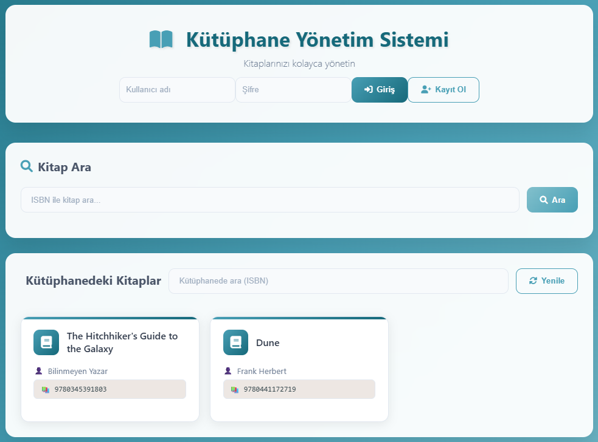

# 📚 Kütüphane Yönetim Sistemi

<p align="center">
  
</p>

<p align="center">
  <a href="#kurulum"></a>
  <a href="#ozellikler"></a>
  <a href="#kullanim"></a>
  <a href="#api"></a>
</p>

Modern, mobil uyumlu, admin ve kullanıcı rolleri olan; kişisel kitap listeleri ve Open Library entegrasyonlu bir sistem.

---

## 🆕 Son Güncellemeler (v1.1.0)
- ✅ **401/404 Hataları Düzeltildi**: `/me` endpoint'i eklendi, logout endpoint'i iyileştirildi
- ✅ **Favicon Eklendi**: Tarayıcı sekmesinde görünen ikon eklendi
- ✅ **Anlık Güncelleme**: Kitap ekleme/güncelleme sonrası liste otomatik yenileniyor
- ✅ **Token Yönetimi**: Local storage entegrasyonu ve otomatik token yenileme
- ✅ **Hata Yakalama**: Gelişmiş hata mesajları ve kullanıcı dostu bildirimler

---

<p align="center">
  
</p>

## 🎨 Tema
Ocean Breeze paleti (projede uygulanmıştır):
- `#16697A` (koyu teal)
- `#489FB5` (mavi
- `#82C0CC` (açık mavi)
- `#EDE7E3` (açık kum)
- `#FFA62B` (vurgu turuncu)

---

## 🚀 Hızlı Başlangıç {#kullanim}

### Gereksinimler
```bash
pip install -r requirements.txt
```

### Çalıştırma
```bash
# Yöntem 1: Doğrudan Python ile
python api.py

# Yöntem 2: Uvicorn ile (geliştirme için)
uvicorn api:app --reload
```

### Erişim
- Web Arayüzü: `http://localhost:8000`
- Swagger Doküman: `http://localhost:8000/docs`
- API Health Check: `http://localhost:8000/health`

### Giriş Bilgileri
- **Admin**: `admin` / `admin123` (tam yetki)
- **Demo Kullanıcı**: `demo` / `demo123` (sınırlı yetki)

---

## ✨ Özellikler {#ozellikler}

### 🔐 Kimlik Doğrulama & Yetkilendirme
- JWT benzeri token tabanlı güvenlik
- Otomatik token yenileme ve local storage entegrasyonu
- Rol tabanlı erişim kontrolü (Admin/User)

### 📱 Kullanıcı Arayüzü
- Mobil uyumlu modern UI (Ocean Breeze renkleri)
- Responsive tasarım
- Gerçek zamanlı durum bildirimleri
- Klavye kısayolları (Enter tuşu desteği)

### 👥 Kullanıcı Rolleri
- **Admin**: 
  - Kütüphaneye kitap ekleme/silme/güncelleme
  - Tüm kitapları görüntüleme ve yönetme
  - ISBN ile Open Library API entegrasyonu
- **Kullanıcı**: 
  - Kişisel kitap listesi oluşturma
  - Okunacaklar ve Okuduklarım listeleri
  - Okundu/okunmadı durumu yönetimi

### 🔍 Kitap Yönetimi
- ISBN ile otomatik kitap bilgisi çekme (Open Library API)
- Gerçek zamanlı arama ve filtreleme
- Anlık liste güncelleme
- Kitap bilgilerini düzenleme

### 💾 Veri Yönetimi
- SQLite veritabanı desteği (varsayılan)
- JSON dosya desteği (alternatif)
- Otomatik veri migrasyonu
- Veri bütünlüğü koruması

---

## 🧭 Arayüz Detayları

### Admin Paneli
- **Kitap Ekleme**: ISBN ile "Kitap Ara ve Ekle"
- **Kitap Düzenleme**: Başlık ve yazar güncelleme
- **Kitap Silme**: Onay modal'ı ile güvenli silme
- **Kütüphane Yönetimi**: Tüm kitapları görüntüleme ve yönetme

### Kullanıcı Paneli
- **Kişisel Liste**: ISBN ile kendi listene ekleme
- **Okunacaklar**: Henüz okunmamış kitaplar
- **Okuduklarım**: Tamamlanan kitaplar
- **Durum Yönetimi**: Okundu/okunmadı işaretleme
- **Liste Yönetimi**: Kitapları listeden kaldırma

---

## 🔌 API Endpoints {#api}

### 🔐 Kimlik Doğrulama
```bash
# Giriş
POST /auth/login
{
  "username": "admin",
  "password": "admin123"
}

# Kayıt
POST /auth/register
{
  "username": "yeni_kullanici",
  "password": "sifre123"
}

# Çıkış
POST /auth/logout
Authorization: Bearer <TOKEN>

# Mevcut Kullanıcı Bilgileri
GET /me
Authorization: Bearer <TOKEN>
```

### 📚 Admin Kitap İşlemleri
```bash
# Kitap Ekleme
POST /admin/books
Authorization: Bearer <TOKEN>
{
  "isbn": "978-0199535675"
}

# Kitap Güncelleme
PATCH /admin/books/{isbn}
Authorization: Bearer <TOKEN>
{
  "title": "Yeni Başlık",
  "author": "Yeni Yazar"
}

# Kitap Silme
DELETE /admin/books/{isbn}
Authorization: Bearer <TOKEN>
```

### 👤 Kullanıcı Kitap İşlemleri
```bash
# Listeye Ekleme
POST /me/books
Authorization: Bearer <TOKEN>
{
  "isbn": "978-0199535675"
}

# Kitapları Listeleme
GET /me/books
Authorization: Bearer <TOKEN>

# Okunan Kitaplar
GET /me/books/read
Authorization: Bearer <TOKEN>

# Okundu İşaretleme
POST /me/books/{isbn}/read
Authorization: Bearer <TOKEN>

# Okunmadı İşaretleme
POST /me/books/{isbn}/unread
Authorization: Bearer <TOKEN>

# Listeden Kaldırma
DELETE /me/books/{isbn}
Authorization: Bearer <TOKEN>
```

### 📖 Genel Kitap İşlemleri
```bash
# Tüm Kitapları Listeleme
GET /books

# Belirli Kitap Arama
GET /books/{isbn}

# Kitap Ekleme (admin olmayan kullanıcılar için)
POST /books
{
  "isbn": "978-0199535675"
}

# Kitap Silme (admin olmayan kullanıcılar için)
DELETE /books/{isbn}
```

### 🏥 Sistem Durumu
```bash
# API Sağlık Kontrolü
GET /health

# API Bilgileri
GET /api
```

---

## 📁 Proje Yapısı
```
Kutuphane-Yonetim-Sistemi/
├── api.py              # FastAPI ana uygulama
├── models.py           # Veri modelleri ve iş mantığı
├── main.py             # Eski CLI uygulaması
├── app.db              # SQLite veritabanı
├── static/             # Frontend dosyaları
│   ├── index.html      # Ana HTML sayfası
│   ├── style.css       # CSS stilleri
│   ├── script.js       # JavaScript kodu
│   └── favicon.ico     # Site ikonu
├── tests/              # Test dosyaları
│   ├── test_api.py     # API testleri
│   ├── test_models.py  # Model testleri
│   └── test_main.py    # CLI testleri
├── requirements.txt     # Python bağımlılıkları
├── library.json        # Örnek kitap verileri
├── users.json          # Örnek kullanıcı verileri
└── README.md           # Bu dosya
```

---

## 🧪 Test Etme

### Test Çalıştırma
```bash
# Tüm testleri çalıştır
pytest

# Sessiz mod
pytest -q

# Belirli test dosyası
pytest tests/test_api.py

# Detaylı çıktı
pytest -v
```

### Test Kapsamı
- ✅ API endpoint'leri
- ✅ Veri modelleri
- ✅ Kimlik doğrulama
- ✅ Kitap işlemleri
- ✅ Kullanıcı yönetimi
- ✅ Hata durumları

---

## 🐛 Bilinen Sorunlar ve Çözümler

### 401 Unauthorized Hatası
**Soru**: Kitap ekleme/güncelleme sonrası 401 hatası alıyorum
**Çözüm**: 
1. Sayfayı yenileyin (F5)
2. Yeniden giriş yapın (admin/admin123)
3. Token'ın geçerli olduğundan emin olun

### Liste Güncellenmiyor
**Soru**: Kitap ekledikten sonra liste güncellenmiyor
**Çözüm**: 
1. Sayfayı hard refresh yapın (Ctrl+F5)
2. API sunucusunu yeniden başlatın
3. Tarayıcı cache'ini temizleyin

### Favicon Görünmüyor
**Soru**: Tarayıcı sekmesinde ikon görünmüyor
**Çözüm**: 
1. Sayfayı yenileyin
2. Tarayıcı cache'ini temizleyin
3. `static/favicon.ico` dosyasının varlığını kontrol edin

---

## 🔧 Geliştirme

### Yeni Özellik Ekleme
1. `models.py`'de veri modelini güncelle
2. `api.py`'de endpoint'i ekle
3. `static/script.js`'de frontend fonksiyonunu ekle
4. `static/index.html`'de UI elementini ekle
5. Test yaz ve çalıştır

### Veritabanı Değişiklikleri
1. `models.py`'de tablo şemasını güncelle
2. Migrasyon fonksiyonu ekle
3. Test verilerini güncelle

---

## 📝 Değişiklik Geçmişi

### v1.1.0 (Güncel)
- 401/404 hataları düzeltildi
- Favicon eklendi
- Anlık liste güncelleme
- Token yönetimi iyileştirildi
- Hata yakalama geliştirildi

### v1.0.0
- İlk sürüm
- Temel kütüphane yönetimi
- Admin ve kullanıcı rolleri
- Open Library API entegrasyonu

---

## 📜 Lisans
MIT License - Detaylar için `LICENSE` dosyasına bakın.

---

## 🤝 Katkıda Bulunma
1. Fork yapın
2. Feature branch oluşturun (`git checkout -b feature/AmazingFeature`)
3. Commit yapın (`git commit -m 'Add some AmazingFeature'`)
4. Push yapın (`git push origin feature/AmazingFeature`)
5. Pull Request açın

---

## 📞 Destek
- **GitHub Issues**: [Proje sayfasında](https://github.com/username/library-project) issue açın
- **Email**: destek@example.com
- **Dokümantasyon**: `/docs` endpoint'inde Swagger UI

---

<p align="center">
  <em>📚 Kitaplar bilginin anahtarıdır. Bu sistem ile kitaplarınızı kolayca yönetin! 📚</em>
</p>
